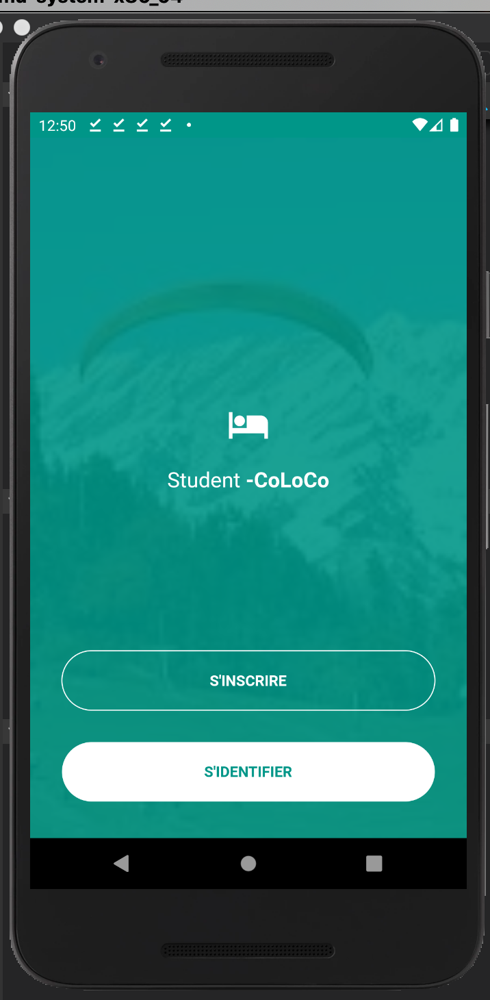

# Co - LOCATION

Co location. 

## Screen Shots

Here are some of the project screen shots.   

  
  

 
 
 

 
 
 
 
 

## Developer(s)
**DAYR Hamza**

## Getting Started

**Note**: Make sure your Flutter environment is setup.
#### Installation

In the command terminal, run the following commands:

    $ git clone https://github.com/hamzadayr/co_loco.git
    $ cd co_loco/
    $ flutter packages get
    $ flutter run
